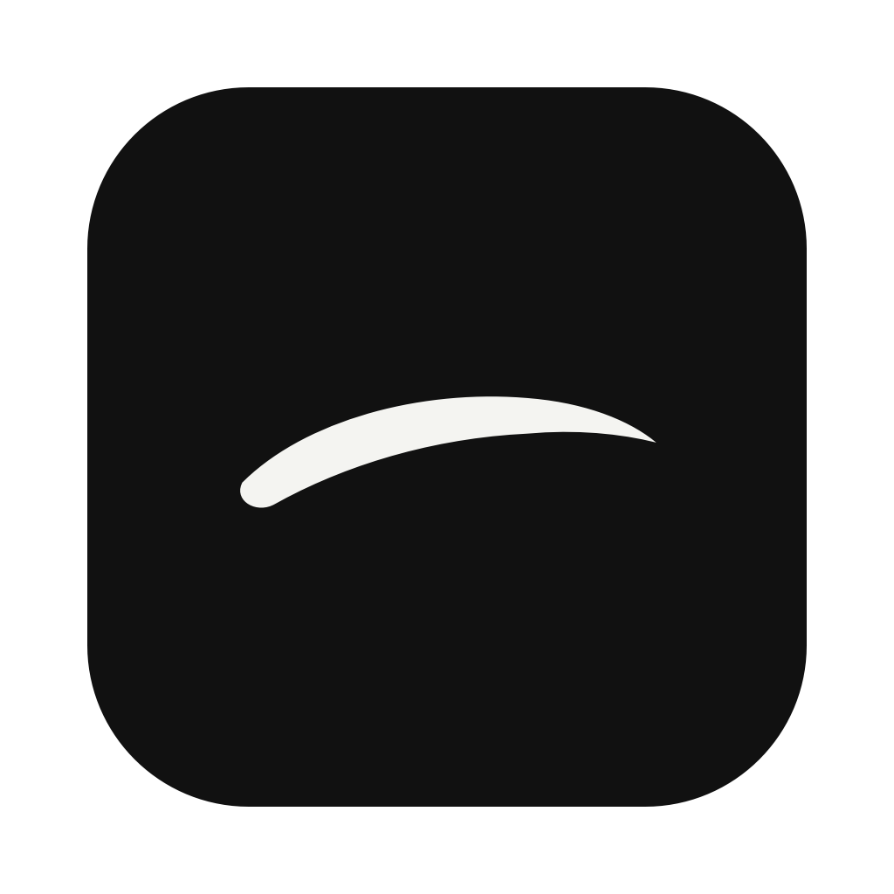
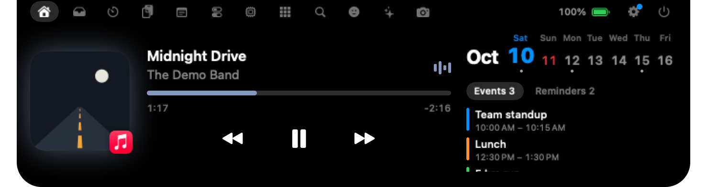

<p align="center"></p>

<h1 align="center">Nunsseop</h1>

<p align="center">
  <b>El notch de tu MacBook, por fin útil.</b><br>
  Música, llamadas, archivos, un lanzador al estilo Spotlight, uso de IA, notificaciones de agentes, tu calendario y HUDs del sistema, todo a un gesto del puntero.
</p>

<p align="center">
  <a href="https://github.com/namekun/Nunsseop/releases/latest"></a>
  
  <a href="LICENSE"></a>
  
</p>

<p align="center">
  <a href="README.md">English</a> · <a href="README.ko.md">한국어</a> · <a href="README.ja.md">日本語</a> · <a href="README.zh-Hans.md">简体中文</a> · <b>Español</b> · <a href="README.de.md">Deutsch</a> · <a href="README.fr.md">Français</a> · <a href="https://namekun.github.io/Nunsseop/">Sitio web</a>
</p>

<p align="center">
  
</p>

*Nunsseop* (눈썹) significa *ceja* en coreano, ese pequeño arco sobre tu pantalla. Es gratuita, de código abierto y sin cuenta, suscripción ni rastreo.

## Instalación en 30 segundos

```sh
brew install --cask namekun/tap/nunsseop
```

Necesita [Homebrew](https://brew.sh). Homebrew quita la marca de cuarentena, así que la app se abre sin problemas. Para actualizar, ejecuta `brew update && brew upgrade --cask nunsseop`; cuando hay una versión nueva, Ajustes › General › Actualizaciones copia ese comando al portapapeles.

Requiere macOS 14 Sonoma o posterior. Funciona en Apple silicon e Intel, y también en pantallas sin notch.

## Tu primer minuto

1. **Pasa el puntero sobre el notch.** Se abre. Aparta el puntero y vuelve a plegarse solo.
2. **Reproduce algo** en Música, Spotify, YouTube Music o cualquier navegador. El notch lo detecta y, plegado, muestra una pequeña carátula y un visualizador.
3. **Haz clic derecho en el notch → Ajustes** para elegir las pestañas, su orden, las ventanas emergentes que quieres y el tamaño.

No hay icono en el Dock. Nunsseop vive en el notch.

## Un vistazo al interior

| | |
| :---: | :---: |
| <br>**Buscar.** Un lanzador de apps, archivos, comandos, portapapeles, emojis y cálculos, con el atajo que prefieras. | <br>**Uso de IA.** Los límites de Claude Code y Codex, sin iniciar sesión. |
| <br>**Estante.** Deja archivos en el notch o suéltalos en AirDrop. | <br>**Temporizador.** Cuenta atrás, Pomodoro y cronómetro, con la duración que quieras. |
| <br>**Herramientas.** Salida de audio, silenciar el micrófono, mantener activo el Mac, grabación de pantalla, selector de color y captura de texto. | <br>**Sistema.** CPU, memoria, disco, red y batería de los dispositivos. |
| <br>**Emoji.** Todos los emojis, con búsqueda y un clic para copiar. | <br>**HUDs.** Volumen, brillo, batería de los AirPods y más. |
| <br>**Llamadas.** La app de la llamada y cuánto llevas hablando. | <br>**De un vistazo.** Elige qué muestra cada lado del notch plegado. |

## Todo lo que hace

**🎵 Música**
- **Reproducción actual de cualquier app.** Música, Spotify, YouTube Music y navegadores como Safari, Chrome, Arc, Dia y Aside. Carátula, controles y una barra de progreso que puedes arrastrar.
- **Letras sincronizadas** de [LRCLIB](https://lrclib.net), bajo el título o bajo el notch mientras trabajas.
- **Vista previa.** Cuando cambia la pista, el título se desliza un momento.
- **Pódcasts y vídeos largos** tienen saltos de 15 segundos y un botón de velocidad (de 1× a 2×), si el reproductor lo admite.

**🗂️ Para ser productivo**
- **Estante.** Arrastra archivos al notch y sácalos después, con vistas previas de imágenes, PDF y vídeos. Las capturas de pantalla y las descargas terminadas pueden llegar allí automáticamente. Si agitas el puntero mientras arrastras archivos, en cualquier lugar, aparece un pequeño destino para soltarlos justo al lado.
- **Calendario y recordatorios.** El día de hoy en cifras grandes, tu semana con un punto en los días ocupados, los eventos de hoy y recordatorios que puedes marcar. Funciona con todas las cuentas añadidas a macOS (Google, iCloud, Exchange y más), y tú eliges qué calendarios se muestran.
- **Próximos eventos.** Cinco minutos antes de que empiece un evento con hora, el notch muestra su título y cuánto falta. Los eventos con un enlace de Zoom, Google Meet, Teams, Webex, FaceTime, Whereby o Chime tienen un botón verde Unirse en Inicio, y al hacer clic en el aviso te unes a la reunión.
- **Una búsqueda que puede sustituir a Spotlight o Raycast.** Apps (incluso las que están fuera de Aplicaciones), archivos, comandos y ajustes del sistema, historial del portapapeles, emojis (empieza con `:`) y cálculos como `12*(3+4)`, ordenados según lo que más abres. Funcionan las iniciales: `vsc` encuentra Visual Studio Code. Las flechas eligen y Retorno abre.
- **Tu atajo.** <kbd>⇧⌘Espacio</kbd> por defecto, o graba cualquier combinación en Ajustes. Nunsseop te avisa si macOS u otra app ya la usa.
- **Temporizador, historial del portapapeles, notas y un selector de emojis.** El historial del portapapeles se queda en memoria y omite todo lo que un gestor de contraseñas marque como secreto. Los parámetros de seguimiento como `utm_` y `fbclid` se quitan de los enlaces que copias.

**💻 Tu Mac**
- **HUDs del sistema.** Volumen, brillo (incluidas las pantallas externas DDC), retroiluminación del teclado, carga, Bloq Mayús y batería de los AirPods aparecen en el notch. Puede quedarse con las teclas de volumen y brillo para que no salga el HUD del sistema.
- **Estadísticas del sistema y baterías.** CPU, memoria, disco y red, además del ratón, el teclado y el trackpad, con un aviso cuando alguno tiene la batería baja.
- **Indicador de cámara y micrófono.** Un punto en el notch mientras cualquier app los usa.
- **Herramientas.** Cambia la salida de audio, ajusta el volumen de cada app (experimental, macOS 14.2+), silencia el micrófono, mantén el Mac activo, graba la pantalla, expulsa discos, toma un color de cualquier punto de la pantalla y copia el texto de cualquier zona de la pantalla.
- **El tiempo, las descargas, el espejo y las apps del Dock**, a un gesto del puntero.

**📞 Incluso plegado**
- **Llamadas.** Durante una llamada en Zoom, FaceTime, Teams, Slack, Discord, WhatsApp o Google Meet, el notch plegado muestra la app y cuánto llevas hablando. Se basa en qué app usa el micrófono, así que no hacen falta permisos adicionales. En Zoom, FaceTime y Meet puedes silenciar el micrófono o apagar la cámara desde el notch, sin cambiar a la llamada.
- **Tú eliges qué se ve en cada lado.** Cuando no suena nada, muestra el uso restante de Claude Code o Codex, los agentes en marcha, la batería, el tiempo o la fecha.
- **Música y temporizadores.** Una pequeña carátula y un visualizador mientras suena música, y el tiempo restante mientras corre un temporizador.
- **Descargas.** El avance en porcentaje de una descarga de Safari o Chrome, a partir del mismo progreso que el Finder muestra en el archivo. No se consulta continuamente.

**🤖 Para desarrolladores**
- **Uso de IA.** Los límites de Claude y Codex con sus horas de restablecimiento, y el uso de tokens de las últimas 5 horas y los últimos 7 días, sumado entre Claude Code, Codex, gjc, omo y OpenCode. Se lee de archivos que esas herramientas ya guardan en tu Mac, así que no hay que iniciar sesión en nada.
- **Límites de Claude en tiempo real (opcional).** La pestaña de IA pregunta una vez si quieres obtener de Anthropic tus límites de Claude de 5 horas y semanales, aproximadamente cada hora, con el inicio de sesión que Claude Code guarda en el llavero. Desactivado hasta que digas que sí; puedes cambiarlo después en Ajustes › Servicios.
- **Notificaciones de agentes y terminales.** Los hooks de Claude Code, Codex, Gemini CLI y OpenCode, los agentes de Muxy, cmux y herdr, y las campanas de tmux y WezTerm aparecen en el notch. Haz clic en un aviso para traer al frente su terminal, panel o pestaña ([configuración más abajo](#notificaciones-de-agentes-y-terminales)).
- **Pestaña Notificaciones.** Los últimos 30 avisos de agentes, terminales y tu calendario, con una insignia para los no vistos; haz clic en uno para volver al lugar de donde vino. Desactivada por defecto (Ajustes › Notch) y guardada solo en memoria.
- **Agentes en marcha.** Un elemento del notch plegado que muestra cuántos agentes de programación te esperan (una mano amarilla) o, si ninguno espera, cuántos están trabajando (un rayo verde). Por ahora sigue a herdr.

**🧩 Hazlo tuyo**
- Elige tus pestañas y su orden, qué muestran la cabecera y el notch plegado, y qué ventanas emergentes recibes. **Lo que desactivas deja de ejecutarse.**
- En macOS 26, el notch desplegado y sus tarjetas usan Liquid Glass, de modo que lo que hay detrás se transparenta con suavidad. Puedes ajustar lo oscuro que es el cristal, hasta el 100 % para un notch negro sólido, o desactivar el cristal.
- En pantallas sin notch, el notch plegado es una pequeña píldora con el logotipo de la ceja dentro de la barra de menús, de cristal si quieres. Se desvanece tras un tiempo sin uso (de 3 a 60 segundos, o nunca) y reaparece cuando el puntero llega hasta ella; si lo dejas medio segundo encima, se abre.
- Elige la pantalla, el tamaño y el retraso al pasar el puntero, abre la app al iniciar sesión y oculta el notch con la tapa cerrada.
- Desliza hacia abajo para abrir, hacia arriba para cerrar, y de lado en Inicio para cambiar de pista.
- Disponible en English, 한국어, 日本語, 简体中文, Español, Deutsch y Français, según el idioma de tu Mac.

## Preguntas frecuentes

<details>
<summary><b>macOS dice que no se puede abrir Nunsseop.</b></summary>

La app aún no está notarizada, así que instálala con Homebrew (`brew install --cask namekun/tap/nunsseop`). Homebrew quita la marca de cuarentena y la app se abre sin problemas.
</details>

<details>
<summary><b>No aparece nada cuando reproduzco música.</b></summary>

Nunsseop muestra lo que macOS indique como En reproducción, así que el reproductor tiene que aparecer en el Centro de control. La mayoría de las apps y los navegadores lo hacen. Consulta [cómo funciona En reproducción](#cómo-funciona-en-reproducción) para ver la alternativa.
</details>

<details>
<summary><b>¿Puede Buscar sustituir a Spotlight?</b></summary>

Sí. Abre Ajustes → Servicios, haz clic en el atajo y pulsa <kbd>⌘Espacio</kbd>. Nunsseop te indicará que Spotlight lo usa y abrirá las Funciones rápidas de teclado, donde desmarcas *Mostrar búsqueda de Spotlight*. Buscar también se abre cuando su pestaña está oculta.
</details>

<details>
<summary><b>Hay demasiadas pestañas.</b></summary>

Haz clic derecho en el notch → Ajustes → Notch y desactiva lo que no necesites. Las funciones desactivadas dejan de ejecutarse por completo.
</details>

<details>
<summary><b>Mi Mac no tiene notch.</b></summary>

En una pantalla sin notch, como un monitor externo con la tapa cerrada, el notch plegado es una pequeña píldora con el logotipo de la ceja flotando dentro de la barra de menús. La ceja se levanta cuando el puntero está encima y, al abrirla, el notch se une al borde superior con su tamaño habitual. Se desvanece cuando no se usa; puedes desactivarlo o cambiar el retraso en Ajustes. Allí mismo eliges también qué pantalla usa.
</details>

<details>
<summary><b>¿Por qué el uso de IA muestra límites antiguos de Claude?</b></summary>

Por defecto, los porcentajes de Claude de 5 horas y semanales salen de cachés que escriben otras herramientas: el HUD de [oh-my-claudecode](https://github.com/Yeachan-Heo/oh-my-claudecode) mientras usas Claude Code en un terminal, o gjc. La tarjeta indica cuándo se actualizaron por última vez. Los límites de Claude también pueden venir directamente de la línea de estado de Claude Code, una vez que la conectes en Ajustes › Servicios. Para tener límites al día sin ellas, activa los límites de Claude en tiempo real en la pestaña de IA o en Ajustes › Servicios. Los totales de tokens siempre están al día.
</details>

<details>
<summary><b>Las teclas de volumen dejaron de mostrar el HUD de Nunsseop tras una actualización.</b></summary>

Las versiones anteriores a la 0.8.3 estaban firmadas de una forma que hacía que macOS olvidara el permiso de Accesibilidad en cada actualización. Desde la 0.8.3 se conserva. Si vienes de una versión anterior, quita Nunsseop una vez de Ajustes del Sistema → Privacidad y seguridad → Accesibilidad y vuelve a permitirlo; surte efecto sin reiniciar.
</details>

## Notificaciones de agentes y terminales

Nunsseop escucha en `127.0.0.1:47750` las notificaciones de las herramientas de tu Mac. Las solicitudes deben incluir el token secreto guardado en `~/Library/Application Support/Nunsseop/notify-token`.

Abre Ajustes → Avisos y pulsa **Conectar** junto a Claude Code, Codex, Gemini CLI u OpenCode. Solo aparecen las herramientas que has usado en este Mac. Nunsseop modifica el archivo de ajustes de esa herramienta (`~/.claude/settings.json`, `~/.codex/config.toml`, `~/.gemini/settings.json`) o añade un plugin a `~/.config/opencode/plugins`, y guarda el archivo anterior con la extensión `.nunsseop-backup`. Codex solo admite un comando `notify`, así que, si ya había uno, sigue ejecutándose después del de Nunsseop. **Desconectar** lo deshace. Las sesiones que inicies después envían sus notificaciones al notch.

Para configurar Claude Code a mano, pulsa **Copiar el comando del hook de Claude Code** y añádelo a `~/.claude/settings.json`:

```json
{
  "hooks": {
    "Notification": [
      { "hooks": [{ "type": "command", "command": "<paste the copied command here>" }] }
    ]
  }
}
```

Los terminales y las apps de agentes no necesitan ningún hook:

- **Muxy** y **cmux:** sus propias notificaciones se leen desde la app y no se muestran mientras está al frente.
- **herdr:** los agentes que terminan o esperan una respuesta, en todas las sesiones, se leen del socket de herdr.
- **tmux:** campanas de cualquier ventana. Nunsseop añade un hook solo al servidor de tmux en marcha; `tmux.conf` no se modifica.
- **WezTerm:** campanas, mediante las líneas que copias desde Ajustes › Avisos y pegas en `~/.wezterm.lua`.

Cada uno tiene un interruptor en Ajustes › Avisos (WezTerm tiene un botón que copia sus líneas de configuración), que solo aparece si la herramienta está instalada. Las herramientas ya conectadas mediante su propio hook no se muestran dos veces.

Cualquier script también puede enviar una:

```sh
curl -X POST http://127.0.0.1:47750/notify \
  -H "Authorization: Bearer $(cat ~/Library/Application\ Support/Nunsseop/notify-token)" \
  -d '{"title": "Build", "message": "Finished in 42 s"}'
```

## Permisos

Nunsseop solo pide un permiso la primera vez que usas la función que lo necesita.

| Función | Permiso | Cuándo se pide |
| --- | --- | --- |
| Calendario | Calendarios | Al pulsar *Permitir acceso* en la pestaña Inicio |
| Recordatorios | Recordatorios | Al pulsar *Permitir recordatorios* en la pestaña Inicio |
| Espejo | Cámara | Al pulsar *Permitir cámara* en la pestaña Espejo |
| Grabación de pantalla y copia de texto de las ventanas de otras apps | Grabación de pantalla | La primera vez que inicias una grabación o capturas texto |
| Grabación con sonido | Micrófono | La primera vez que grabas con el audio del micrófono activado |
| Quedarse con las teclas de volumen, brillo y retroiluminación del teclado | Accesibilidad | Al activar la opción en Ajustes |
| Reproducción actual alternativa para Música, Spotify y navegadores | Automatización | Solo si el helper de MediaRemote no está disponible |
| Mostrar llamadas de Google Meet, Zoom y Teams en un navegador | Automatización (ese navegador) | La primera vez que un navegador usa el micrófono |
| Abrir al iniciar sesión | Ítems de inicio | Al activarlo en Ajustes |

## Privacidad

Nunsseop no recopila ni envía datos personales. Solo se conecta a internet para:

- consultar `api.github.com` en busca de una versión nueva una vez al día (se puede desactivar);
- buscar letras sincronizadas en `lrclib.net` (se puede desactivar);
- obtener el tiempo de `open-meteo.com` para la ciudad que indiques (desactivado hasta que indiques una), y pedir al geocodificador de Apple la ubicación de la ciudad cuando Open-Meteo no la encuentra;
- descargar carátulas por HTTPS desde servicios de música conocidos, solo cuando el helper de MediaRemote no está disponible;
- pedir a `api.anthropic.com` tus límites de Claude aproximadamente cada hora, con el inicio de sesión de Claude Code guardado en el llavero, solo si activas los límites de Claude en tiempo real.

Todo lo demás se queda en tu Mac. El servidor de notificaciones solo acepta conexiones de este Mac. El uso de IA se lee de archivos locales, salvo que actives los límites de Claude en tiempo real. Los avisos de la pestaña Notificaciones se guardan solo en memoria. Las grabaciones se guardan junto a tus capturas de pantalla. La vista previa de la cámara solo funciona mientras la pestaña Espejo está abierta y nunca se graba. El historial del portapapeles se borra al salir de Nunsseop.

## Cómo funciona «En reproducción»

Desde macOS 15.4, el framework privado MediaRemote solo responde a procesos firmados por Apple. Nunsseop incluye una pequeña biblioteca auxiliar (`Sources/NowPlayingHelper`) que se ejecuta dentro del `/usr/bin/perl` del sistema, lee el estado de En reproducción, envía los comandos de reproducir, pausar, saltar de pista y desplazarse por la pista, y devuelve líneas JSON a la app.

Esto depende de una API privada, así que una futura actualización de macOS podría dejar de funcionar. Si ocurre, Nunsseop recurre a AppleScript para Música y Spotify y a leer las pestañas multimedia en los navegadores. Esa alternativa necesita tener activado *Permitir JavaScript desde Apple Events* en cada navegador. Dia no tiene un elemento de menú para ello, así que Nunsseop ofrece reabrirlo con `--enable-applescript-javascript`.

## Compilar desde el código fuente

```sh
git clone https://github.com/namekun/Nunsseop.git
cd Nunsseop
./scripts/bundle.sh release      # build/Nunsseop.app
./scripts/make-dmg.sh            # build/Nunsseop-<version>.dmg
```

Necesitas las herramientas de línea de comandos de Xcode con Swift 5.10 o posterior. `scripts/bundle.sh` compila el paquete de Swift y lo envuelve en un bundle de app con firma ad hoc.

## Licencia

[MIT](LICENSE). Los issues y los pull requests son bienvenidos.
